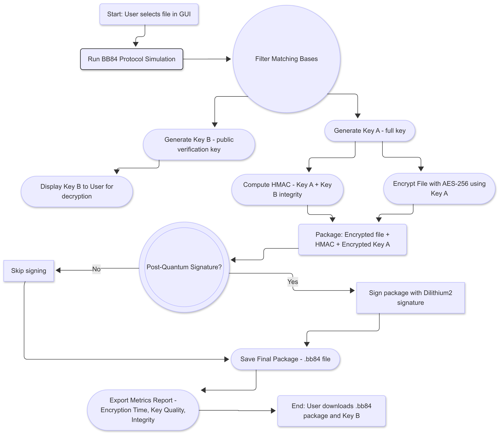
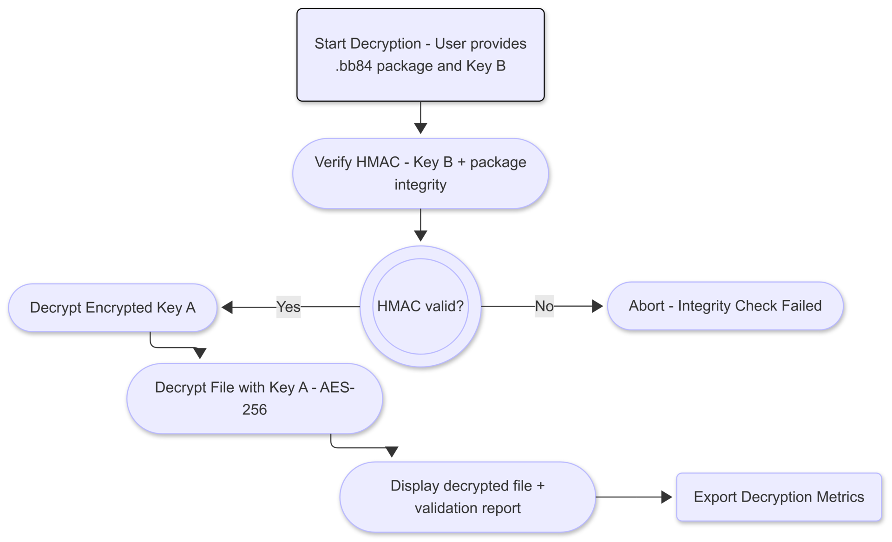
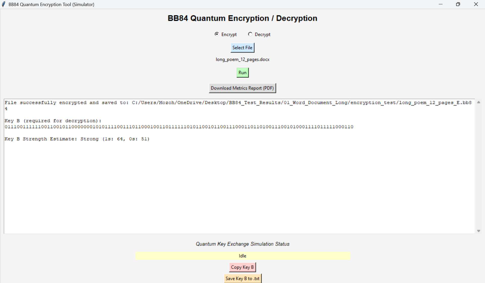
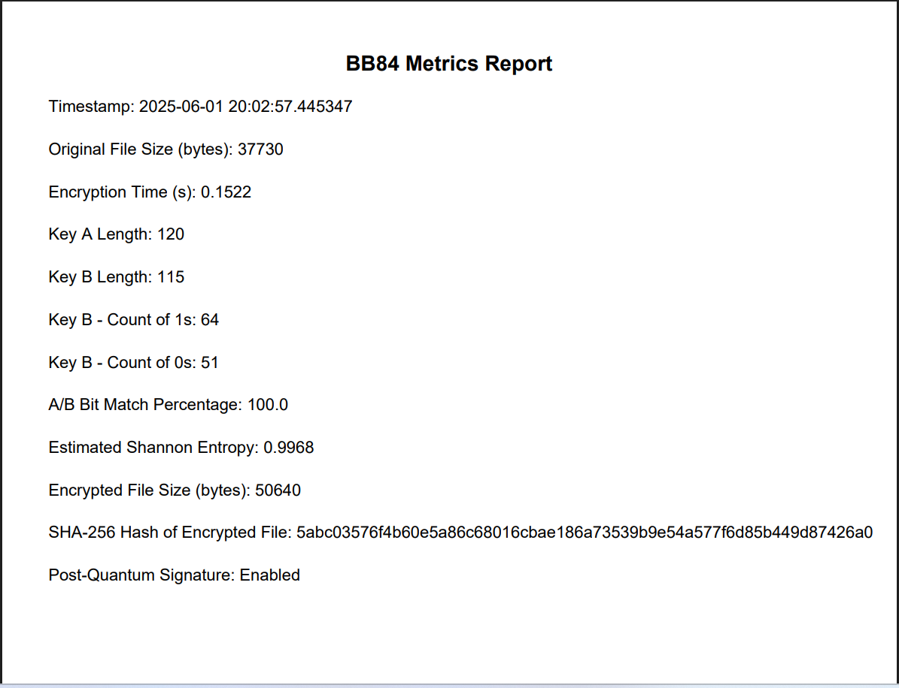
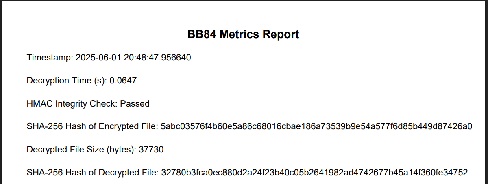

Corresponding author: Hector Mozo (HectorMozo@my.uopeople.edu)  
Secondary email: hectormozo308@gmail.com  
LinkedIn: https://www.linkedin.com/in/hector-mozo-462899312/  


## Abstract

The BB84 Hybrid Quantum-Classical Encryption Tool is an open-source framework designed to demonstrate the integration of quantum key distribution principles with classical cryptographic techniques for secure file encryption. The system implements a complete encryption and decryption pipeline based on a simulated BB84 quantum key exchange protocol, combined with AES-256 symmetric encryption, HMAC-based integrity validation, and optional post-quantum signature support using Dilithium2.

Developed with a modular architecture, the tool separates quantum logic, cryptographic engines, and the GUI layer, enabling flexible reuse and future extensions. It features a user-friendly interface, comprehensive metrics reporting, and a unique Key A / Key B split model to enforce a zero-trust decryption process.

This software can serve as an educational and research platform for exploring hybrid post-quantum cryptography, as well as a practical proof-of-concept for secure information transmission in modern and future computing environments.

## Statement of need

As quantum computing capabilities advance, the need for cryptographic systems that can withstand quantum attacks has become a critical research area [@bernstein2017post]. Hybrid cryptographic solutions, combining quantum key distribution (QKD) and classical encryption, offer a promising approach to achieving both forward secrecy and compatibility with existing infrastructures [@chen2016nist].

While theoretical models of QKD exist, many implementations focus on the quantum layer alone, lacking integration with practical encryption workflows or usable tools for real-world applications [@liu2024hybrid]. In particular, tools that combine QKD-inspired key exchange with robust symmetric encryption, integrity verification, and post-quantum signature schemes remain scarce in open-source form.

The BB84 Hybrid Quantum-Classical Encryption Tool addresses this gap by providing an open-source, modular framework that combines a simulated QKD process with AES-256 encryption and HMAC-based integrity validation. It also supports optional post-quantum digital signatures using Dilithium2 [@bos2018crystals], ensuring strong protections even in the presence of quantum-capable adversaries.

By emphasizing end-to-end encryption workflows and providing reproducible metrics, the tool offers a valuable platform for education, experimentation, and early-stage research on hybrid cryptographic architectures.

## Software description

The BB84 Hybrid Quantum-Classical Encryption Tool is implemented as an open-source Python framework, designed with a modular architecture to facilitate experimentation with hybrid cryptographic protocols and serve as an educational and research platform.

### Architecture

The architecture of the tool is shown in Figure 1. The system consists of four main components:

- **Quantum Key Generation Module**: Simulates the BB84 protocol using Qiskit [@abraham2019qiskit], producing two keys: Key A (used internally) and Key B (shared for decryption validation).
- **Cryptographic Engine**: Performs AES-256 encryption with salted key derivation and HMAC-based integrity validation.
- **Post-Quantum Signature Integration**: Optionally applies a Dilithium2 signature [@bos2018crystals] to the package.
- **Graphical User Interface (GUI)**: Provides user-friendly interaction and visualization.

**Figure 1. Modular Architecture of the BB84 Hybrid Quantum-Classical Encryption Tool.**  
The diagram shows the separation between GUI, controller logic, core cryptographic components, and secure I/O packaging.


---

### Encryption Process

The encryption workflow integrates quantum key generation with classical encryption and post-quantum digital signature mechanisms.

The BB84 protocol generates a shared key through basis comparison and sifting. The expected length of the shared key \( K \) is given by:

$$
|K| = L \times p_{\text{match}}
$$

where:

- \( L \) = number of qubits transmitted  
- \( p_{\text{match}} \) = probability of matching measurement bases (~50%)

Key A is then used to derive the AES encryption key \( K_{\text{AES}} \), and to compute an HMAC for integrity:

$$
C = E_{\text{AES-256}}(M, K_{\text{AES}})
$$

$$
H = \text{HMAC}_{\text{SHA-256}}(C \mid K_B)
$$

where:

- \( M \) = plaintext message  
- \( C \) = ciphertext  
- \( K_B \) = Key B used for verification

An optional Dilithium2 signature is computed over the package for post-quantum integrity:

$$
\sigma = \text{Sign}_{\text{Dilithium2}}(C \mid H \mid \text{Enc}(K_A))
$$

**Figure 2. Encryption Process of the BB84 Hybrid Quantum-Classical Encryption Tool.**  
The diagram shows the flow from BB84 key generation to encryption, integrity validation, and optional post-quantum signing.



---

### Decryption Process

The decryption process begins with the user providing the encrypted package and Key B. The system verifies integrity and decrypts Key A and the original file.

Integrity verification:

$$
H' = \text{HMAC}_{\text{SHA-256}}(C \mid K_B)
$$

If \( H' = H \), the package is authentic. The decryption proceeds:

$$
M = D_{\text{AES-256}}(C, K_{\text{AES}})
$$

**Figure 3. Decryption Process of the BB84 Hybrid Quantum-Classical Encryption Tool.**  
The diagram shows the process of integrity verification and decryption of the original file.



---

### Graphical User Interface (GUI)

**Figure 4. GUI of the BB84 Hybrid Quantum-Classical Encryption Tool during Encryption.**  
The GUI provides a user-friendly interface for interacting with the hybrid cryptographic process.



---

### Example Metrics

The tool generates detailed metrics during encryption and decryption, supporting reproducibility and evaluation.

**Figure 5. Example Encryption Metrics.**  


**Figure 6. Example Decryption Metrics.**  



## Installation and usage

The BB84 Hybrid Quantum-Classical Encryption Tool is implemented in Python 3.9+ and is distributed as an open-source repository. The required dependencies are listed in `requirements.txt` and can be installed with:

```bash
pip install -r requirements.txt
```

Main dependencies include:

- Qiskit (Abraham et al., 2019) for quantum key simulation
- Cryptography for AES-256 and HMAC computation
- pqcrypto for optional post-quantum signature support

After installation, the tool can be executed via its graphical user interface (GUI) or as a Python module.

To launch the GUI:

```bash
python gui/bb84_gui.py
```

To use the tool programmatically:

```python
from core.bb84_quantum import bb84_protocol

key_a, key_b, match_indices = bb84_protocol(length=256, authenticate=True)
```

The software has been tested on major operating systems (Linux, Windows, macOS) and requires no special hardware.

---

## Example(s)

A typical run of the BB84 Hybrid Quantum-Classical Encryption Tool produces both secure output packages and detailed process metrics.

During encryption, the tool generates an `.bb84` package containing the AES-encrypted file, an HMAC-based integrity tag, an encrypted version of Key A, and an optional Dilithium2 signature. Additionally, it displays Key B to the user for future decryption.

Figures 5 and 6 (previously shown in the Software description section) illustrate typical metrics collected during encryption and decryption, respectively. These metrics include timing information, key quality assessment, and integrity verification results, enabling reproducibility and comparative analysis across different runs.

A typical execution log may appear as follows:

```plaintext
[INFO] Quantum key generation completed. Shared key length: 128 bits
[INFO] AES-256 encryption completed.
[INFO] HMAC computed and verified.
[INFO] Optional Dilithium2 signature applied.
[INFO] Final package saved: encrypted_file.bb84
[INFO] Key B: XXXXXX-XXXXXX-XXXXXX
```

The tool can also be invoked programmatically as a Python module. For example:

```python
from core.bb84_quantum import bb84_protocol

key_a, key_b, match_indices = bb84_protocol(length=256, authenticate=True)
```

This flexibility allows users to integrate the tool in automated workflows or research pipelines beyond the provided graphical user interface.

## Reuse potential

The BB84 Hybrid Quantum-Classical Encryption Tool is designed to be modular and extensible, enabling its reuse beyond the original use case of secure file encryption.

The core quantum key generation module and cryptographic engine can be integrated into other Python-based software systems, such as:

- Hybrid post-quantum secure communication protocols
- Research prototypes for QKD-inspired cryptographic schemes
- Educational platforms for teaching quantum and hybrid cryptography concepts

The software’s modular architecture facilitates adaptation to different user interfaces or backends, and its metrics reporting capabilities make it suitable for comparative evaluations and reproducible research in the field of post-quantum and hybrid cryptography.

## References

